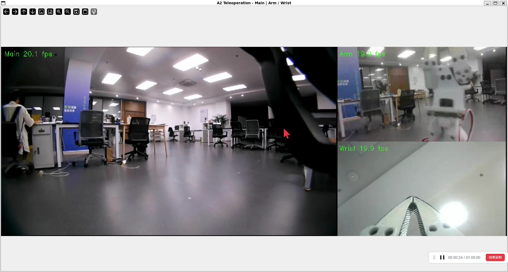

# u_robot_teleop · A2 遥操作、SO-101 主从臂与三路视频

本仓库整理了 PC1 上位机的宇树手柄 BLE 转发、A2 UDP 遥控、SO-101 主从机械臂遥操作，以及主摄像头、机械臂全景和腕部摄像头的三路视频回传。它保留 2026-09-13 的实际项目源码、修改过的 LeRobot 和实验记录，便于另一台 PC1 或下位机恢复环境、阅读实现和继续维护。

**PC1 Windows 负责 BLE，PC1 WSL 负责编排、主臂读取和视频显示；Unitree 宿主机负责从臂与摄像头，Docker 只负责机器狗运动接收。** Docker 运动接收器与导航工程在关联仓库 [u_robot_move](https://github.com/lsclsc2026/u_robot_move)。本仓库不能单独替代该下位机运行工程、SDK 或 Docker 镜像。

[](https://github.com/lsclsc2026/u_robot_teleop/releases/tag/v0.1.0-review)

[观看／下载原速演示（约 55 秒）](https://github.com/lsclsc2026/u_robot_teleop/releases/tag/v0.1.0-review)：主画面 + Arm / Wrist，54.534 秒、无音轨，发布视频仅压缩尺寸与码率，未加速。见[视频说明](docs/VIDEO.md)。演示中的 FPS 叠字不能证明本次源码版本的实际端到端延迟，也不能代替最新三路同时运行的验收。

## 从哪里开始

| 文档 | 内容 |
|---|---|
| [架构与源码入口](docs/ARCHITECTURE.md) | 三条控制／视频链路、主从关节与进程边界 |
| [安装与恢复](docs/INSTALL.md) | Windows、WSL、LeRobot、Unitree 宿主机和 Docker 环境 |
| [配置](docs/CONFIGURATION.md) | IP、串口、标定、Python 路径、容器差异及可用参数 |
| [启动与停止](docs/USAGE.md) | 原配手柄、BLE 手柄、分步运行与日志 |
| [视频](docs/VIDEO.md) | 三路参数、独立解码、演示下载和帧率边界 |
| [排障](docs/TROUBLESHOOTING.md) | BLE、UDP、串口、标定、摄像头、运动锁 |
| [来源与限制](docs/PROVENANCE.md) | 原始目录、修改过的 LeRobot、历史文档与发布范围 |
| [第三方声明](THIRD_PARTY.md) | 保留许可及外部依赖 |

## 包含的工程

```text
remote_teleop/       WSL 入口、主臂发送、宿主机从臂/视频部署源文件
windows_ble_test/    Windows BLE 发送、扫描、监视和映射工具
a2_joystick_lab/     原始 C++ 协议/桥接/运动模式源码、CMake、实验文档
lerobot/            带本地修改的完整归档源码、依赖声明、锁文件与许可
calibration/        指定设备的主臂标定备份（不是通用标定）
docs/               安装、配置、运行、架构、视频和发布来源说明
```

`a2_joystick_lab` 同时包含只读监视器和能够控制运动的网络桥接器，不能把整个目录都当作只读采集程序。`remote_teleop` 中旧版 compositor、Insta360 与标定工具也完整保留；默认窗口入口已经使用 `dashboard_latest.py`。

## 启动前要落实的配置

安装步骤见 [INSTALL.md](docs/INSTALL.md)。PC1 WSL 需要能免交互 SSH 到 Unitree、访问主臂串口，并接收 Unitree 返回的 UDP。下面的 IP 和设备序列号来自原部署，均是**配置样例**，迁移时替换为实际设备；它们不是凭据。

```bash
# 在 PC1 WSL 的本仓库根目录执行；只设置配置，不会启动机器人。
export TELEOP_REPO="$PWD"
export UNITREE_HOST=unitree-a2-wifi
export UNITREE_WIFI_IP=172.18.21.114
export PC1_WIFI_IP=172.18.21.246
export PC1_IP="$PC1_WIFI_IP"
export LEADER_PORT=/dev/ttyACM0
export ARM_VIEW_MODE=uvc
export ARM_VIEW_DEVICE=/dev/v4l/by-path/pci-0000:00:14.0-usb-0:4.1.1:1.3-video-index0
export DURATION_SEC=3600
```

`PC1_WIFI_IP` 用于 BLE 回路，`PC1_IP` 用于机械臂来源过滤与视频回流，应显式设为同一个可达的 Windows／镜像 WSL 局域网地址。BLE 入口还要配置 `WINDOWS_PYTHON`、`WINDOWS_BLE_SCRIPT`、`WINDOWS_CSV` 和 `BLE_ADDRESS`，见[完整启动示例](docs/USAGE.md)。

**容器兼容：**本次关联的导航发布默认使用 `unitree-review`，本仓库保留的历史 `pc1_ble_docker.py` 默认仍为 `unitree-dev`。组合脚本没有 `CONTAINER` 环境变量接口。请按[配置文档](docs/CONFIGURATION.md)显式选择已部署运动接收器的容器；不能仅改容器名字就假定接收器已安装。

## 运行状态与边界

原交接记录中，用户已确认手柄控制和主从控制可运行。最新视频实现改为腕部 30→20 FPS 转换、RealSense SDK 采 RGB、三路独立解码并显示最新帧；**最新版本三路同时实机帧率及端到端延迟仍未完成验收**。这次发布只做源码整理、文档和发布文件检查，没有编译、功能测试或机器人操作，也不声称历史测试已全部通过。

真实从臂控制需要 `ARM_REAL_CONTROL=YES`；BLE 组合入口还要求 `A2_REAL_CONTROL=YES`，并按原实现使用 `--no-deadman`。原配手柄版本与 BLE 版本不能同时运行，真实导航与遥控也不能同时占用运动控制。退出默认关闭从臂扭矩，应先托住从臂；关闭视频窗口不会停止控制。详见[启动与停止](docs/USAGE.md)。

标定备份仅对应主臂串口序列号 `5B3D047743` 和历史从臂 `5B3D047726`，不是其他机械臂的默认值。仓库不包含虚拟环境、编译产物、日志、原始录像、Docker 镜像、SSH 私钥或密码。总项目没有新增开源许可证；第三方源码沿用其原有许可，见 [THIRD_PARTY.md](THIRD_PARTY.md)。
