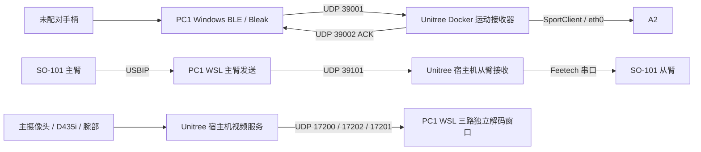

# 架构与源码入口

[返回首页](../README.md)

## 三条链路

SSH 用于脚本部署、启动、退出和 Docker 心跳；连续运动指令及视频通过 UDP 传输。VS Code 不参与实时数据转发。BLE 使用 Windows 的蓝牙栈，WSL 使用 usbipd 转来的主臂串口；不是把 BLE 设备也当作 Linux 串口。

## 进程与文件

| 位置 | 文件 | 职责 |
|---|---|---|
| PC1 WSL | `remote_teleop/start_stack_ble_pc_remote.sh` | 启动狗接收器，等待 TELEOP_READY，启动臂/视频与 Windows BLE |
| PC1 WSL | `remote_teleop/start_stack_native_remote.sh` | 原配手柄控狗时，只编排机械臂与视频 |
| PC1 WSL | `remote_teleop/pc1_ble_docker.py` | SSH 调下位机 Docker 入口，保持 stdin 心跳，退出时先关闭接收链 |
| PC1 WSL | `remote_teleop/launch_pc1_operation.sh` | 检查主臂、部署宿主机脚本、启动窗口和主臂发送 |
| PC1 WSL | `remote_teleop/pc1_leader_sender.py` | 读取六关节、发送 UDP、接收 ACK、记录 CSV |
| PC1 Windows | `windows_ble_test/ble_udp_sender.py` | Bleak 接收手柄，按发送频率产生狗控制数据包 |
| Unitree 宿主机 | `remote_teleop/unitree_follower_receiver.py` | 来源/序号/CRC 检查，初始化、同步、限幅与从臂写入 |
| Unitree 宿主机 | `remote_teleop/unitree_launch_services.sh` | 运行从臂、主视频转发、腕部和全景摄像头 |
| Unitree 宿主机 | `remote_teleop/unitree_uvc_camera_sender.sh` | 全景采集入口；识别 D435i 后转 RealSense SDK 分支 |
| PC1 WSL | `remote_teleop/dashboard_latest.py` | 三路 GStreamer 解码进程 + 各路读取线程 + 最新帧窗口 |
| C++ 原工程 | `a2_joystick_lab/src/network_bridge.cpp` | A2 网络控制桥接实现；SDK 和运行二进制不随包提供 |

`arm_udp_protocol.py` 与 `so101_bus.py` 两端共用。关节依次为 `shoulder_pan / shoulder_lift / elbow_flex / wrist_flex / wrist_roll / gripper`，由各自设备的 LeRobot 标定转换，不额外设计一套网络关节映射。

接收端默认 dry-run；只有 `--enable-motors` 与 `ARM_REAL_CONTROL=YES` 同时满足才启用从臂。有效数据包需要协议版本、CRC、来源 IP 和递增序号均通过。过期队列丢弃，只采用最新目标；约 250 ms 无新包时停止写入新目标，伺服保持最后目标，不能理解为失联立即卸力。启动有姿态差硬上限和平滑同步，实时跟随有限幅。

## Docker 与宿主机

狗接收器来自 [u_robot_move](https://github.com/lsclsc2026/u_robot_move) 的 `scripts/run_teleop_docker.sh`，历史容器内二进制为 `install/u_robot_teleop/lib/u_robot_teleop/a2_network_bridge`。这个 ROS 包名与本 GitHub 仓库名相同，但本仓库是上位机整合源码，不是该 Docker 工作区的替代品。

宿主机 `~/arm_remote` 保存从臂和视频环境；容器工作区与宿主机的同名目录可能是两份独立文件，不能假定自动同步。历史部署使用 host 网络，日志挂载为宿主机 `/home/unitree/unitree-data/logs` 到容器 `/home/unitree/data/logs`。具体新部署以关联工程的说明和当前 Docker 配置为准。

视频任务独立退出清理，单路异常可以降级；从臂初始化失败、关键发送器退出等仍可能结束组合流程。窗口退出本身不等于控制停止。
